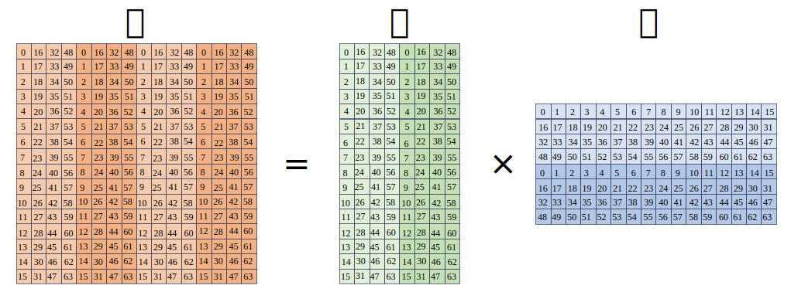
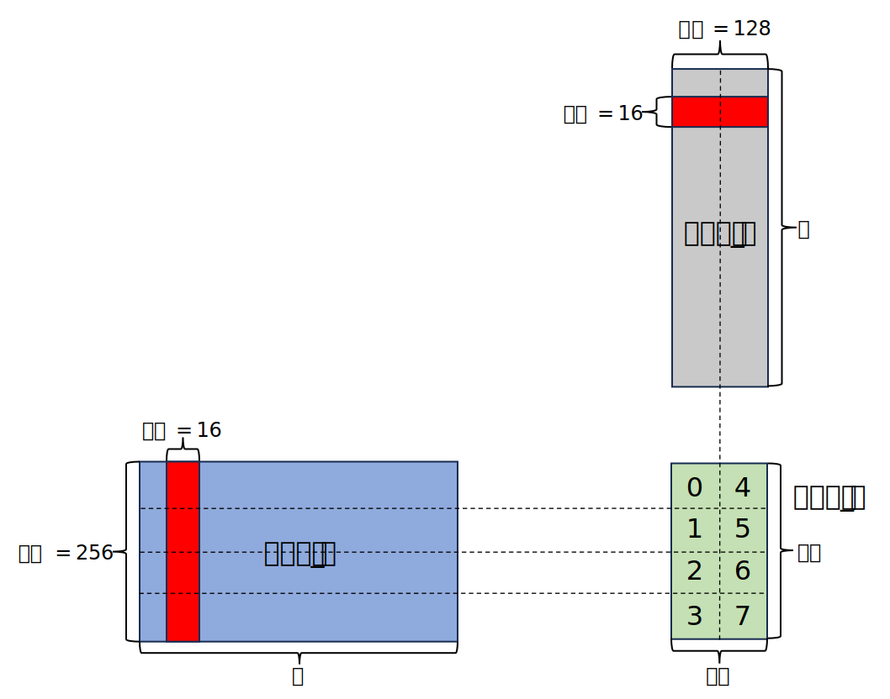
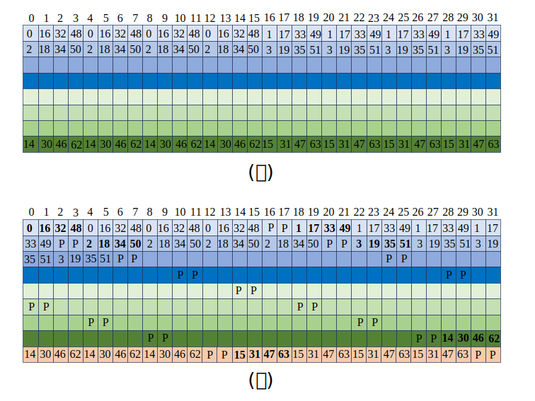
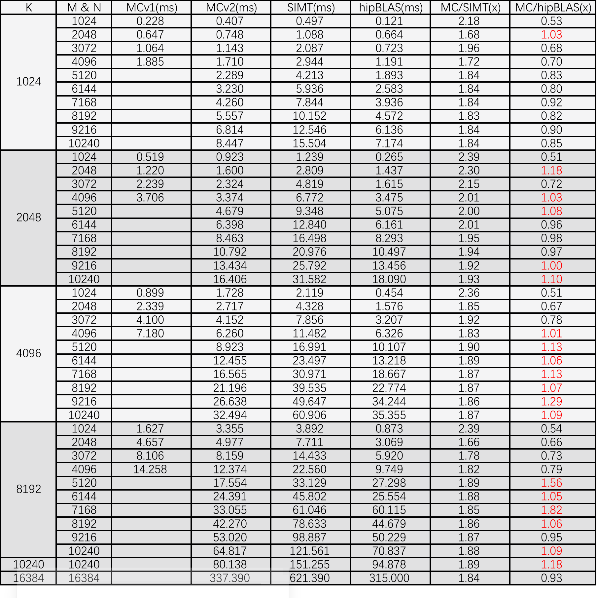

# Introduction

The DCU is an accelerator designed for deep learning training, inference, and compute-intensive numerical tasks. The main hardware-cards, K100 and K100-AI, support the HIP programming framework. This work aims to develop and optimize kernels for **Single-precision GEneral Matrix Multiplication (SGEMM), Sparse Matrix Multiplication (SpMM),  and Convolution Computation (CC)** — three fundamental operators in AI and scientific computing. Accelerating these operators will contribute to the growth of the DCU ecosystem. All experiments will be conducted on a single K100-AI with dtk25.04.

# Operator Types

## SGEMM

### Overview

The conventional approach to optimizing GEMM on DCUs involves SIMD units combined with tiling strategies. However, this overlooks newer hardware features in architectures like the K100-AI. Based on AMD's RDNA architecture, the K100-AI integrates Matrix Cores (MC) within its Compute Units (CUs)—specialized hardware units for matrix Fused Multiply-Add (FMA) operations, offering significant performance gains for GEMM-based tasks.

This project aims to accelerate SGEMM by leveraging MCs instead of conventional SIMD units. There are three main approaches for MC programming:

1. Using the ROCMMA C++ namespace, which provides high-level abstractions such as `load_matrix_sync`, `mma_sync`, and `store_sync` for loading, computing, and storing matrix tiles. This method is user-friendly but lacks low-level control.
2. Embedding LLVM Intermediate Representation (IR) assembly directly in the code, offering fine-grained register control but with high complexity and error-proneness.
3. Employing MC-specific LLVM intrinsic instructions, which strike a balance between abstraction and control, though they require precise understanding of instruction sizes and matrix layout constraints.

### Optimization methods

#### 1. Accelerating using MC instructions

The work uses intrinsic instructions to invoke MC operations. However, due to limited documentation, the supported instruction sizes and matrix layout requirements are unclear. By learning AMD RDNA architecture materials, we revealed the MC-supported instructions and tile sizes for various data types on the DCU:

| datatype |              instruction              |       computation shape       |
| :------: | :-----------------------------------: | :---------------------------: |
|   FP16   | __builtin_amdgcn_mmac_f32_16x16x16f16 | (16, 16) = (16, 16) x (16,16) |
|   FP32   | __builtin_amdgcn_mmac_f32_16x16x4f32  |  (16, 16) = (16, 4) x (4,16)  |
|   FP32   | __builtin_amdgcn_mmac_f32_16x16x8f32  |  (16, 16) = (16, 8) x (8,16)  |
|   INT8   | __builtin_amdgcn_mmac_i32_16x16x32i8  | (16, 16) = (16, 32) x (32,16) |

For SGEMM, we use the intrinsic `__builtin_amdgcn_mmac_f32_16x16x8f32`. Based on NVIDIA GPU tensor core programming practices, this instruction requires each thread in a DCU wavefront (64 threads) to provide 2 FP32 elements for input matrix A, 2 FP32 elements for matrix B, and 4 FP32 elements for output matrix C via registers. However, due to the lack of official documentation on data layout, we reverse-engineered and experimentally determined the layout scheme, as illustrated in **Figure 1**.

**Figure 1.** Threads 0–63 represent the elements held by each thread in a wavefront. For example, thread 0 holds two elements of matrix A, two of matrix B, and four of matrix C.

#### 2. Efficient thread workload partitioning

Using HIP’s built-in query interface, we found that each CU in the DCU K100-AI has 64KB of shared memory and 256KB of registers. The shared memory is shared across 4 SIMD units, with registers evenly divided among them (up to 64KB per SIMD). In GPU GEMM kernels, the tile size of the output matrix C processed by each thread block significantly impacts performance—larger tiles generally mean higher compute intensity, better data reuse, and improved efficiency. However, tile size is limited by shared memory capacity. Since MC programming is wavefront-based (unlike traditional SIMD’s thread-level), each wavefront should handle the largest possible sub-tile of C to maximize register reuse, a key factor in performance. Unfortunately, sub-tile size is also constrained by available registers. On DCU, each thread block contains 512 threads (8 wavefronts), with each thread having up to 128 32-bit registers.

Assuming a thread block processes a tile of size BM × BN, each wavefront handles 64 × 64 elements, so there are (BM/64) × (BN/64) wavefronts per block. In each iteration along the reduction dimension C, tiles of A (BM × BK) and B (BK × BN) are loaded from global memory into shared memory. Each wavefront then loads its portion into registers, performs MC instructions, accumulates partial results in registers, and finally writes the results back to global memory after all iterations.

The task partitioning is illustrated in **Figure 2**, with BM=256, BN=128, BK=16. Each thread block contains 8 wavefronts (512 threads), consumes 24KB of shared memory ((256+128)×16×4 bytes), and each thread uses 80 32-bit registers (4 × 2 + 4 × 2 + 4 × 4 × 4).

**Figure 2.** Tiles 0–7 represent the sub-tiles of matrix C processed by each wavefront within a thread block.

#### 3. Shared memory bank conflict avoidance

During computation above, tiles of input matrix A (BM × BK) and matrix B (BK × BN) are loaded into shared memory. Without modification, loading tile_A causes severe shared memory bank conflicts among the 64 threads in a wavefront due to the data layout shown in **Figure 3(a)**. This results in multiple conflicts per read transaction, significantly reducing memory access efficiency and increasing latency.

To avoid this, we pad the BK dimension of tile_A_SMEM by 2 elements, allocating shared memory of size BM × (BK+2) but only using BM × BK. The extra two elements per row serve as padding to prevent bank conflicts. After padding, as shown in **Figure 3(b)**, the 64 threads can load 64 floats in two transactions of 32 floats each, achieving 100% shared memory bandwidth utilization.

**Figure 3.** In subfigures (a) and (b), the first row (0–31) represents register bank indices, while subsequent rows (0–63) denote thread indices within a wavefront. "P" indicates padded dummy data.

#### 4. Register double buffering

To partially hide MC computation latency, double buffering is applied by allocating twice the registers for tiles A and B, consuming 96 32-bit registers per thread. In each main kernel iteration, all threads load tile_A (BM × BK) and tile_B (BK × BN) from global to shared memory. Each wavefront then loads sub_tile_A (64 × 8) and sub_tile_B (8 × 64) into private registers for MC computation while simultaneously preloading the next sub-tiles into the alternate buffer. Since the two register buffers have distinct physical addresses, data-loading instructions for the second set can be issued before the first computation completes (once dispatched and issued), enabling overlap of computation and memory access to improve hardware utilization.

#### 5. Bypassing shared memory & implicit matrix transposition.

After each wavefront completes the iteration over dimension C and obtains the final tile results of matrix C, the results must be written back to global memory. Reorganizing the results in shared memory before the write-back to improve coalesced access would require 128KB (BM × BN × 4 = 256 × 128 × 4) of shared memory, exceeding hardware limits. Reducing BM or BN would limit data reuse and degrade performance. Therefore, results are written directly from registers to global memory, bypassing shared memory.

However, writing results directly from registers causes scattered global memory addresses within a wavefront, leading to poor bandwidth utilization (~12.5%), severely impacting performance. Writing back the transpose C^T instead improves bandwidth utilization to 50%. Combined with L2 cache effects, this yields significant performance gains without affecting correctness.

To obtain C^T, the SGEMM formula C = A × B is transformed to C^T = B^T × A^T. Implementation-wise, this requires swapping the MC instruction’s input matrices. The original column-major B becomes row-major B^T, and row-major A becomes column-major A^T. Thus, no changes are needed in loading data from global memory to shared memory or from shared memory to registers.

### Evaluation

**Figure 4** shows runtime statistics for DCU SGEMM tasks computing C[M, N]=A[M, K] × B[K, N]. MCv1 and MCv2 are two of our implementations—MCv1 targets cases with M, N<4096, while MCv2 is used otherwise. The SIMT implementation is our version without MMAC instructions, and hipBLAS is the official implemenation. The last two columns show speedup of the best MC implementation over the other two. Our MC implementations generally achieve up to 80% of hipBLAS performance across dimensions and surpass hipBLAS by 50% in some cases.

**Figure 4.** The running time of SGEMM with different M, N, K computation sizes.

### Future work

We will explore optimizing dense matrix multiplication on DCU using MMAC instructions for other supported data types (e.g., FP16 and INT8), extending the applicability of the proposed optimization methods in future.

## SpMM

### Overview

Four optimized SpMM kernels were implemented for different dense matrix column counts (`B_cols`), building upon GE-SPMM. The kernels support multiplication of a CSR-format sparse matrix `A` with a dense matrix `B`, producing output matrix `C = A × B`. The design balances low latency and high throughput, adapting to varying computational scales.

### Optimization methods

#### 1. `topoSimpleSPMMKernel`

- **Use case:** `B_cols ≤ 16`
- **Optimizations:**
  - Thread layout: `blockDim.x = B_cols`, `blockDim.y` controls parallel row count; each thread computes one `C[i][j]`.
  - Simple access pattern: direct indexing via `A_indices[ptr]*k + threadIdx.x` to fetch values from `B`.
  - Suitable for small matrices: minimal overhead, avoids shared memory synchronization and scheduling costs.

#### 2. `topoCacheSPMMKernel`

- **Use case:** `16 < B_cols ≤ 32`
- **Optimizations:**
  - One warp (32 threads) computes one entire row; one block has 4 warps processing 4 rows.
  - Shared memory double buffering reduces global memory reads:
    - First half caches `A_indices * k` as `int`;
    - Second half caches `A_value` via `reinterpret_cast<float*>`.
  - Thread organization: `threadIdx.x` controls columns, `threadIdx.y` controls rows.

#### 3. `topoCacheCoarsenSPMMKernel`

- **Use case:** `32 < B_cols ≤ 64`
- **Optimizations:**
  - Adapted for DCU architecture with warp size extended to 64; one warp computes a full row, one block has 4 warps for 4 rows.
  - Shared memory structure similar to the previous kernel, adjusted for 64-thread warps.

#### 4. `topoCacheCoarsenSPMMKernel`

- **Use case:** `B_cols > 64`
- **Optimizations:**
  - Enhanced thread coarsening: each thread computes two outputs, `C[i][j]` and `C[i][j + 64]`.
  - Thread block structure unchanged; one block still processes four rows, with the same shared memory layout.

### Evaluation

Speedup comparison against the HIPSparse library (using datasets from SC’24 *High Performance Unstructured SpMM Computation Using Tensor Cores*) as well as common GNN datasets such as Cora and PubMed. All results are averaged over 100 iterations.

| datasets/dimenion N |    16    |    32    |   64    |   128   |   256   |   512   |
| :-----------------: | :------: | :------: | :-----: | :-----: | :-----: | :-----: |
|        cora         | 30.8788  | 26.5184  | 29.9618 | 22.431  | 25.0725 | 19.411  |
|       pubmed        | 14.3344  | 14.9773  | 15.9921 | 11.9665 | 8.45362 | 4.16395 |
|      1138_bus       | 29.3398  |  28.822  | 41.4751 | 46.081  | 27.308  | 32.5606 |
|        mip1         | 2.22529  | 2.36305  | 2.23816 | 1.80598 | 2.0741  | 3.09602 |
|   conf5_4-8x8-05    | 3.78038  | 7.17126  | 4.6495  | 2.93645 | 3.7128  | 12.677  |
|        cant         | 5.16841  | 8.18898  | 5.44911 | 3.38795 | 5.81143 | 5.77901 |
|       pdb1HYS       | 5.59647  | 4.68221  | 4.81582 | 3.23094 | 4.06468 | 5.12636 |
|        rma10        |  3.821   | 4.93509  | 3.92792 | 3.02602 | 4.99961 | 9.24117 |
|      cop20k_A       | 5.81414  | 5.17675  | 5.92021 | 7.2518  | 6.55372 | 4.55902 |
|       consph        | 4.05908  | 4.64691  | 4.01913 | 2.64237 | 5.03461 | 5.04705 |
|      shipsec1       | 4.06805  | 3.98109  | 3.86629 | 4.60971 | 9.27691 | 6.60423 |
|         dc2         | 0.437486 | 0.681029 | 4.99878 | 4.67928 | 9.37952 | 17.7691 |

### Future work

We will apply different sparse formats tailored to specific sparse matrix structures in future.

## CC

### Overview

In the naive implementation of CC, computation proceeds by processing one position in one channel at a time, then moving to the next channel, resulting in poor data reuse. The nested loops introduce significant redundant computation, and although there are data reuse opportunities among threads within a block, the actual reuse rate remains low.

### Optimization methods

#### 1. **Optimize  Computation Order to Improve Data Reuse**

Compute all positions within a channel before switching to the next to enhance cache locality and reuse. Dynamically adjust the batch size based on workload characteristics to improve data locality, parallelism, and hardware utilization.

#### 2. **Leverage Shared Memory for Data Access**

Store reusable intermediate data in GPU shared memory to accelerate subsequent accesses. Use multi-threaded loading with coalesced memory accesses to maximize memory throughput.

#### 3. **Loop Optimization and Register Utilization**

Hoist loop invariants to eliminate redundant computations. Use local registers to cache frequently accessed variables, reducing memory latency and improving kernel execution efficiency.

### Evaluation

- Parameters：
int      n;                            // batch szie           
int      c;                            // channel number       
int      h;                            // height               
int      w;                           // width               
int      k;                            // filter number         
int      r;                            // filter Height            
int      s;                            // filter Width             
int      u;                            // filter stride in Height 
int      v;                            // filter stride in Width  
int      p;                            // padding in Height 
int      q;                            // paddiing in Width 

​       int      Oh;                         // height of output tensor
​       int      Ow;                        // width of output tensor

Oh = (int)((h-r+2*p)/u) + 1;
Ow = (int)((w-s+2*q)/v) + 1;

- Data Layout：
Input tensor：nchw
Filter tensor：kcrs
Output tensor：nkOhOw

| case | n    | c    | H    | W    | k    | r    | s    | u    | v    |
| ---- | ---- | ---- | ---- | ---- | ---- | ---- | ---- | ---- | ---- |
| 1    | 128  | 3    | 225  | 225  | 32   | 3    | 3    | 2    | 2    |
| 2    | 49   | 128  | 35   | 35   | 384  | 3    | 3    | 2    | 2    |
| 3    | 16   | 128  | 105  | 105  | 256  | 3    | 3    | 2    | 2    |
| 4    | 128  | 3    | 230  | 230  | 64   | 7    | 7    | 2    | 2    |
| 5    | 2    | 3    | 838  | 1350 | 64   | 7    | 7    | 2    | 2    |
| 6    | 256  | 256  | 28   | 28   | 256  | 2    | 2    | 2    | 2    |

| case | inital runtime（s） | optimized runtime（s） | speedup |
| :--- | ------------------- | ---------------------- | ------- |
| 1    | 9917.18             | 1089.06                | 9.11    |
| 2    | 40894.28            | 4274.17                | 9.57    |
| 3    | 87847.83            | 8127.57                | 10.81   |
| 4    | 107413.24           | 10236.57               | 10.49   |
| 5    | 37426.68            | 4316.59                | 8.67    |
| 6    | 83252.01            | 12879.94               | 6.46    |

### Future work

Efficient algorithms such as Winograd can be used to optimize convolution, reducing computational complexity and improving execution efficiency.